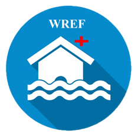

<!-- PROJECT LOGO -->
 

  

  <h3 align="center"><b>WREF</b></h3>

  

    Mobile Agriculture Application
     
    Provide the best services to Vietnamese farmers and pesticide shops
     
     
    <a href="https://github.com/othneildrew/Best-README-Template">View Demo</a>
    ·
    <a href="https://github.com/othneildrew/Best-README-Template/issues">Report Bug</a>
    ·
    <a href="https://github.com/othneildrew/Best-README-Template/issues">Request Feature</a>
  

<!-- TABLE OF CONTENTS -->

  
Table of Contents

  <ol>
    <li>
      <a href="#about-the-project">About The Project</a>
      <ul>
        <li><a href="#built-with">Built With</a></li>
      </ul>
    </li>
    <li>
      <a href="#getting-started">Getting Started</a>
      <ul>
        <li><a href="#prerequisites">Prerequisites</a></li>
        <li><a href="#installation">Installation</a></li>
      </ul>
    </li>
    <li><a href="#usage">Usage</a></li>
    <li><a href="#roadmap">Roadmap</a></li>
    <li><a href="#contributing">Contributing</a></li>
    <li><a href="#license">License</a></li>
    <li><a href="#contact">Contact</a></li>
    <li><a href="#acknowledgements">Acknowledgements</a></li>
  </ol>

<!-- ABOUT THE PROJECT -->

## About The Project

AnCv will build a Mobile Agriculture Application called WREF to provide the best services to Vietnamese farmers and pesticide shops.

### Application for farmers

 

   
  
  

Farmers need a cheap product that solves all their problems: natural disasters, diseases, wrong pesticide products and low yields.

- Use AI to recognize images and diagnose diseases on trees, thereby recommending solutions and products to use.
- Use RS and AI to predict crop yields.
- Use OpenWeather API and AI for flood prediction and early weather forecast.

In addition, farmers can also directly order agricultural tools, fertilizers, pesticides, etc. from the retailers in the system.

### Application for pesticides retailers

 

   
  
  

Pesticides retailers will use a secondary application to be able to post the products being sold in the store to the system, if a farmer places an order, they can clearly see the farmer's information. when they order products on the app.

## Tech Stack

### Technology used

- Font-End: [Java](https://getbootstrap.com), [Kotlin](https://getbootstrap.com), [Dart](https://getbootstrap.com).

- Back-End: [Node.js](https://getbootstrap.com) (Express.js), [Php](https://getbootstrap.com) (Larvel).
- IDE: [Android studio](https://getbootstrap.com), [VS Code](https://getbootstrap.com) (Larvel), [Pycharm](https://getbootstrap.com) (Larvel).

### Core technologies

- [AI](https://getbootstrap.com)
- [RS](https://jquery.com)
- [Openweather API](https://laravel.com)

<!-- GETTING STARTED -->
